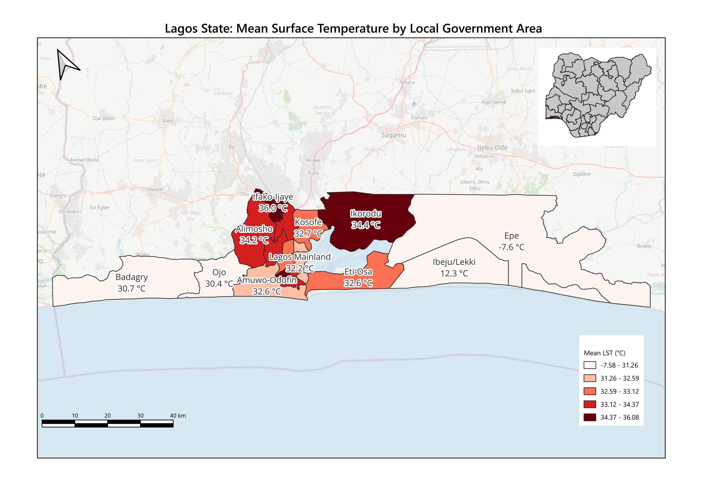

# Month 1 Summary — Lagos Urban Heat Islands

## 1. Question

Which LGAs in Lagos State show the strongest surface urban heat island effect, and how many people live in them?

## 2. Operation and why

**Operation:** spatial join (QGIS *Join attributes by location*), run after zonal statistics.

**Steps**

1. **Zonal statistics (temperature):** mean, min and max land surface temperature (°C) per LGA from the Landsat 8/9 ST_B10 mosaic (28 Jan and 5 Feb 2026, Path 191 Rows 055/056), converted with `DN × 0.00341802 + 149.0 − 273.15`.
2. **Zonal statistics (population):** sum of the WorldPop v3.0 raster per LGA.
3. **Spatial join:** joined the population layer onto the temperature layer by location, one-to-one, predicate *[fill in: e.g. "are within" / "equal"]*, so each LGA carries both its mean temperature and its population.

**CRS:** both layers in **EPSG:32632** (WGS 84 / UTM 32N, metres), confirmed in Layer Properties before running.

**Output:** `Data/processed/lga_lst_pop.gpkg`

**Why this operation:** answering the question needs temperature and population side by side for the same units. A spatial join combines the two zonal-statistics layers on geometry rather than on LGA names, which avoids silent mismatches from spelling differences (for example "Ifako-Ijaiye" vs "Ifako/Ijaye"). LGAs were used instead of wards because Admin 3 ward coverage for Lagos is only partial in the HDX dataset and is not yet verified.

## 3. Prediction (written before running)

| What | Expected |
| --- | --- |
| Number of features | 20, one per Lagos LGA |
| Empty geometries | 0 |
| Mean LST per LGA | Roughly 28–38 °C for a dry-season late-morning scene |
| Hottest LGAs | Dense mainland core: Mushin, Oshodi-Isolo, Ajeromi-Ifelodun, Lagos Mainland |
| Coolest LGAs | Coastal and less built-up: Epe, Ibeju-Lekki, Badagry |
| Population per LGA | Roughly 200,000 to over 2 million; Alimosho the largest |
| Population total | Equal to the WorldPop sum over the whole Lagos boundary |

## 4. Checks

| # | Check | How | Result |
| --- | --- | --- | --- |
| 1 | **Map** | Viewed the output over the LGA boundaries and the LST raster; graduated symbology on mean LST | *[fill in: pattern looked plausible? any LGA out of place?]* |
| 2 | **Row count** | Attribute table feature count vs expected 20 | *[fill in: count found]* |
| 3 | **One feature by hand** | Picked *[fill in: LGA]*. Checked its mean LST by sampling several pixels with Identify Features, and its population by comparing the joined value with the value in the original population zonal-stats layer | *[fill in: values matched / difference found]* |
| 4 | **Empty geometry** | Field Calculator filter `is_empty_or_null($geometry)` (or *Check validity*) | *[fill in: number of empty or null geometries]* |

**Anything odd, and what I did about it:**

- **Epe (−7.6 °C) and Ibeju-Lekki (12.3 °C) had impossible mean temperatures.** Every other LGA fell between about 30 and 36 °C, so these two stood out on the map straight away, and they also stretched the lowest legend class down to −7.58 °C.
- **Likely cause:** the mosaic of Path 191 Rows 055 and 056 does not fully cover eastern Lagos; parts of Epe and Ibeju-Lekki appear to fall in the neighbouring path (190). The uncovered or fill pixels (DN 0, which converts to about −124 °C) were not set as NoData in the raster file, so zonal statistics averaged them into those two LGAs' means. Setting transparency in the layer style does not affect zonal statistics; NoData has to be set in the file itself.
- **How I checked:** viewed the LST raster over Epe and Ibeju-Lekki to look for missing coverage and the scene edge, and reran zonal statistics with pixel *Count* to compare against the other LGAs. *[fill in: what you saw, e.g. "a straight scene edge with no data east of it"]*
- **What I did:** *[fill in: e.g. "Masked invalid pixels as NoData (−9999) and reran zonal statistics" / "Excluded Epe and Ibeju-Lekki and marked them as No data on the map" / "Added the Path 190 scene to the mosaic"]*. Until full coverage is in place, results for these two LGAs are not valid and are left out of the hottest/coolest comparison.

## 5. Results

| What | Result |
| --- | --- |
| Features | *[fill in]* |
| Mean LST range across LGAs (valid) | 30.4 – 36.1 °C, excluding Epe and Ibeju-Lekki |
| Full range as computed | −7.6 – 36.1 °C (the low end is the Epe coverage error, see above) |
| Hottest LGAs | Agege (36.1 °C), Ifako-Ijaye (36.0 °C), Ikorodu (34.4 °C), Alimosho (34.2 °C) |
| Middle band | Kosofe (32.7 °C), Amuwo-Odofin (32.6 °C), Eti-Osa (32.6 °C), Lagos Mainland (32.2 °C) |
| Coolest LGAs (valid) | Ojo (30.4 °C), Badagry (30.7 °C) |
| Invalid (incomplete coverage) | Epe (−7.6 °C), Ibeju-Lekki (12.3 °C) |

**Pattern:** the hottest LGAs form a belt along the northern mainland (Agege, Ifako-Ijaye, Alimosho) and Ikorodu, rather than the southern core I expected. The western coastal LGAs, Ojo and Badagry, are the coolest valid results, about 5.7 °C below Agege.

**Map:**

## 6. What surprised me

The hottest LGAs were on the northern mainland (Agege, Ifako-Ijaye, Alimosho) and Ikorodu, not the dense southern core I predicted (Mushin, Oshodi-Isolo, Lagos Mainland). The impossible values for Epe (−7.6 °C) and Ibeju-Lekki (12.3 °C) also showed that my Landsat mosaic doesn't cover eastern Lagos fully.

## 7. Data I still need

- **NDVI** from Landsat Bands 4 and 5 for the same dates, to test how much of the heat pattern is explained by vegetation loss (the project's main hypothesis).
- **Verified ward boundaries** for Lagos, to move from 20 coarse LGAs to finer units; large LGAs such as Epe and Ibeju-Lekki average dense towns with empty wetland.
- **QA_PIXEL band** for cloud masking, since the scenes carry 16% cloud cover and cloud edges can pull temperatures down.
- **Built-up or land-cover data** (building footprints or a land-cover map), to separate heat from buildings, roads and industrial land.
- **More dry-season dates**, to build a multi-date median rather than relying on two late-morning scenes.
